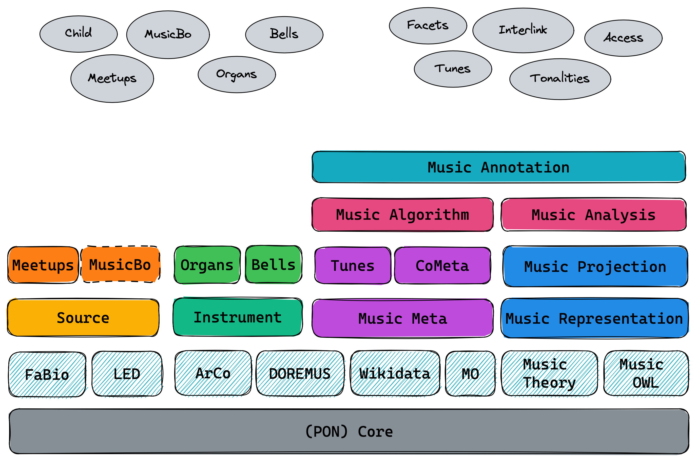

# Polifonia Ontology Network (PON)

This repository contains references to the Polifonia Ontology Network.

> 🔗 Ontology URI: [https://w3id.org/polifonia/ontology/ontology-network/](https://w3id.org/polifonia/ontology/ontology-network/)

The Polifonia Ontology Network (PON) provides a modular backbone of music
ontologies to address both cultural heritage and more general queries in the
music domain. As illustrated in the diagram below, `PON v1.0` comprises 15
ontology module that are organised thematically (colours, horizontal view) and
hierarchically, to highlight their dependencies (vertical view). At the bottom
of the architecture lies our `Core` module (providing general-purpose elements
of design, ODPs, and alignments) and the reused ontologies. Four foundational
models provide interoperability across PON through their abstract design:
`Source`, `Instrument`, `Music Meta`, and `Music Representation`. These are
specialised and extended in the upper levels to add functionalities and
contextualise specific domains.

A summary of PON modules is given in the table below, with links to the
repositories storing the modules with documentation, diagrams, and examples.
Through our foundational models, PON ontologies can be applied to a wide set of
music projects, and the modular design simplifies extensibility and maintenance.

## Ontology modules of Polifonia Ontology Network

| **Ontology**             | **Prefix** | **Description**                                                                                | **URI**                                                   | **Repository**                                                     |
|--------------------------|------------|------------------------------------------------------------------------------------------------|-----------------------------------------------------------|--------------------------------------------------------------------|
| **FULL**                 | pon:       | The FULL ontology module stored in this repository, which imports all the modules listed here. | https://w3id.org/polifonia/ontology/ontology-network/     | https://github.com/polifonia-project/ontology-network/             |
| **Core**                 | core:      | Elements of general reuse and ontology design patterns.                                        | https://w3id.org/polifonia/ontology/core/                 | https://github.com/polifonia-project/core-ontology                 |
| **Music Meta**           | mm:        | Achieving interoperability of music metadata.                                                  | https://w3id.org/polifonia/ontology/music-meta/           | https://github.com/polifonia-project/musicmeta-ontology            |
| **Music Representation** | mr:        | Foundational model to describe arbitrary musical content.                                      | https://w3id.org/polifonia/ontology/music-representation/ | https://github.com/polifonia-project/music-representation-ontology |
| **Music Instrument**     | mop:       | Instruments and their evolution through time and space.                                        | https://w3id.org/polifonia/ontology/instrument/           | https://github.com/polifonia-project/instrument-ontology           |
| **Source**               | src:       | Representing musical sources and their context of production.                                  | https://w3id.org/polifonia/ontology/source/               | https://github.com/polifonia-project/source-ontology               |
| **Tunes**                | tunes:     | A specialisation of Music Meta for folk music.                                                 | https://w3id.org/polifonia/ontology/tunes/                | https://github.com/polifonia-project/tunes-ontology                |
| **CoMeta**               | com:       | An extension of Music Meta to represent music corpora.                                         | https://w3id.org/polifonia/ontology/cometa/               | https://github.com/polifonia-project/cometa-ontology               |
| **Music Projection**     | mp:        | Achieving interoperability of music notation systems.                                          | https://w3id.org/polifonia/ontology/music-projection/     | https://github.com/polifonia-project/music-projection-ontology     |
| **Organs**               | organ:     | A rich descriptive model of organs and building methods.                                       | https://w3id.org/polifonia/ontology/organs/                | https://github.com/polifonia-project/organs-ontology               |
| **Bells**                | bell:      | Describing bells, bell towers and bell ringers.                                                | https://w3id.org/polifonia/ontology/bells/                 | https://github.com/polifonia-project/bells-ontology                 |
| **Music Algorithm**     | mx:        | Computational methods for music and their parametrisation.                                     | https://w3id.org/polifonia/ontology/music-algorithm/      | https://github.com/polifonia-project/music-algorithm-ontology      |
| **Music Analysis**      | ma:        | Music analysis through reasoning using modal-tonal theories.                                   | https://w3id.org/polifonia/ontology/music-analyis/        | https://github.com/polifonia-project/music-analysis-ontology       |
| **Music Annotation**    | ann:       | A wrapper of ontologies for music annotations (audio, symbolic).                               | https://w3id.org/polifonia/ontology/music-annotation/     | https://github.com/polifonia-project/music-annotation-ontology     |

## Contributing

🙌 We encourage you to explore and leverage the Polifonia Ontology Network v1.0
to enhance your music-related applications, research, and collaborations. Your
feedback and contributions are highly appreciated as we continue to refine and
expand this ontology network.

Let the power of ontologies unlock new possibilities in the world of music! 🎵✨

## License

This work is licensed under a [Creative Commons Attribution 4.0 International License](http://creativecommons.org/licenses/by/4.0/).
